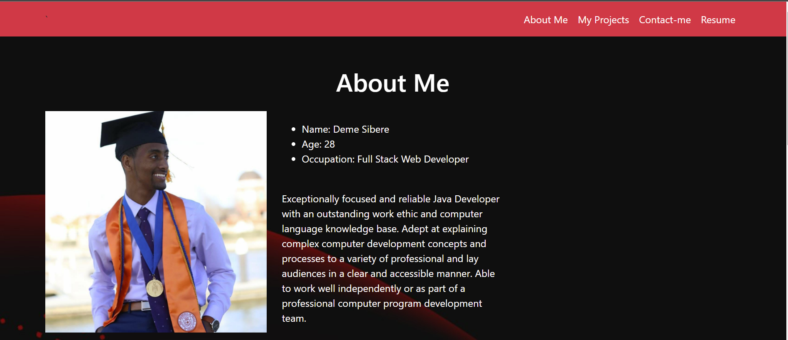
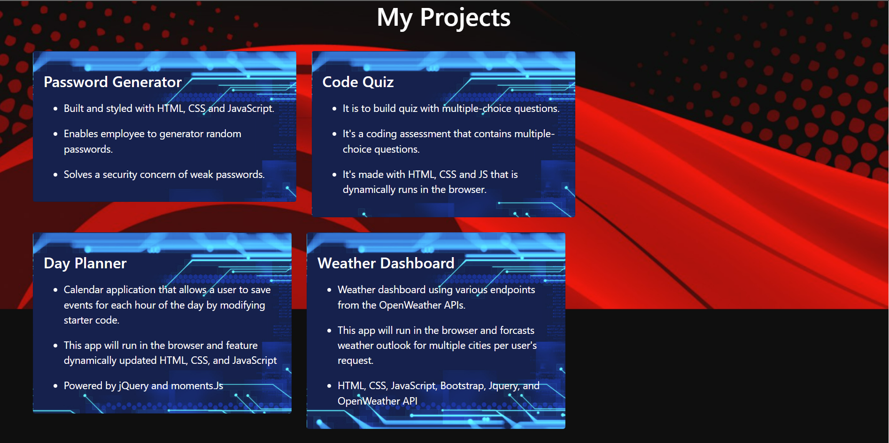
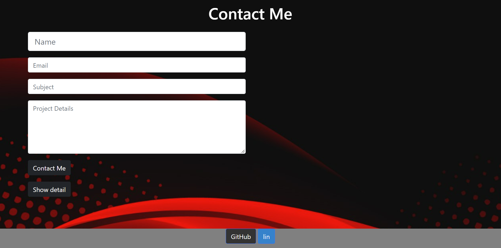
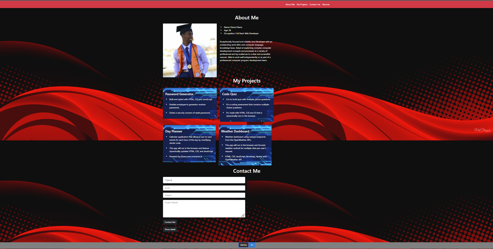

# My Updated Portfolio

## Discription

To create a web application from scratch! A portfolio that satisfies a typical hiring manager’s needs. 
These portfolios will assess your skills and show the thought process behind each project. Several projects 
created in the future will be added and displayed in this portfolio.


## Table of Contents
- [Description](#description)
- [User Story](#user-story)
- [Acceptance Criteria](#acceptance-criteria)
- [My Task](#my-task)
- [Mock-Up](#mock-up)
- [Technologies Used](#technologies-used)
- [Project Samples](#project-samples)
- [Questions](#questions)


## User Story

```
AS AN employer
I WANT to view a potential employee's deployed portfolio of work samples
SO THAT I can review samples of their work and assess whether they're a good candidate for an open position
```


## Acceptance Criteria

Here are the critical requirements necessary to develop a portfolio that satisfies a typical hiring manager’s needs:

```
GIVEN I need to sample a potential employee's previous work
WHEN I load their portfolio
THEN I am presented with the developer's name, a recent photo or avatar, and links to sections about them, their work, and how to contact them
WHEN I click one of the links in the navigation
THEN the UI scrolls to the corresponding section
WHEN I click on the link to the section about their work
THEN the UI scrolls to a section with titled images of the developer's applications
WHEN I am presented with the developer's first application
THEN that application's image should be larger in size than the others
WHEN I click on the images of the applications
THEN I am taken to that deployed application
WHEN I resize the page or view the site on various screens and devices
THEN I am presented with a responsive layout that adapts to my viewport
```


## My Task

* Created a Portfolio that contains links to GitHub profile, LinkedIn Profile, and Resume PDF.
* Portfolio displays examples of projects from deployed projects/homeworks 
* All of the projects have title, deployment URL, GitHub URL, and a screenshots.
* Portfolio's user interface is responsive and polished.
* GitHub profile contains a bio, email, and link to deployed portfolio.
* Each pinned projects have a README containing project descriptions, screenshots, and links to deployed applications.
* Followed few developers on GitHub
* Attached a concise and tailored resume 
* Added a strong bio statement to LinkedIn profile, professional photo, and links to GitHub and portfolio.


## Mock-Up

This project has been deployed to GitHub pages.

* GitHub Repository: https://github.com/DemeSibere/updated-portodolio-page
* Deployed GitHub Page: https://demesibere.github.io/updated-portodolio-page/
* Portofolio Demo with local storage:


* Screenshots of the deployed page:






_________
## Technologies Used

- HTML
- CSS
- JavaScript and 
- Bootstrap 

## Project Samples

* Passwork Generator: https://demesibere.github.io/my-password-generator-hw/
* Code Quiz: https://demesibere.github.io/code-quiz-hw/
* Day Planner: https://demesibere.github.io/MyWork-Day-Scheduler/
* Weather Dashboard: https://demesibere.github.io/my-weather-dashboard/
* National Park Locator Group Project: https://github.com/Kevno5/ProjectOne
* Good README Generator: https://github.com/DemeSibere/myReadMe-Generator-
* Team Profile Generator: https://github.com/DemeSibere/myteam-profile-generator

## Questions

For Inquries about projects, you may contact me via Github: 
        ``
            Github: DemeSibere``` ``

For Any Addistional questions, you may reach me at: 
```
            Email: demesibere16@gmail.com`

